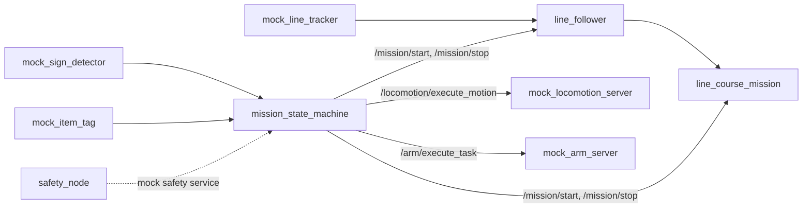
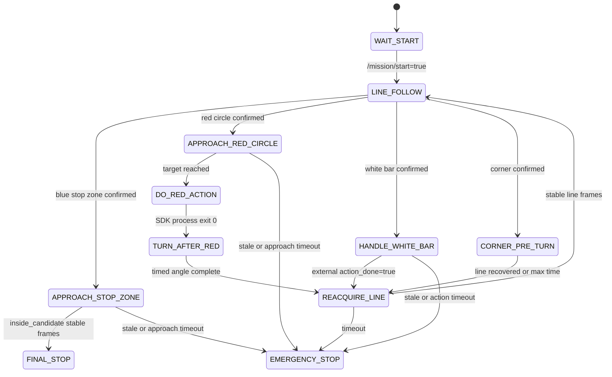
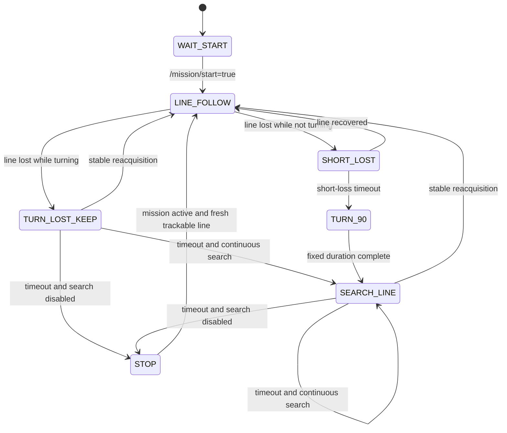

# 当前实际架构（National Competition Baseline）

## 审计范围与结论

本文记录 `master` 提交 `1046004` 的实际源码和 launch 组合。它描述“现在有什么、实际怎样连”，不把规划文档、mock 成功或尚未接线的 adapter 当成已实现功能。

当前最重要的架构事实是：

- 仓库已有一条真实 D435i 巡线到 Go2 SDK UDP 的子系统链。
- 完整比赛状态机只有 mock launch 把 perception、locomotion、arm 和 mission 组合起来。
- 仓库没有把完整 mission、真实 gait action、真实 arm、真实 sign/item perception 和单一最终速度 bridge 组合起来的真实全赛程 launch。
- 当前每个已有 launch 通常保持一个最终 `/navigation/cmd_vel` 发布者；如果手工拼装完整硬件栈，`line_course_mission_node` 与 `gait_control_node` 会同时发布该 topic，现有 control lock 不能仲裁二者。

## 1. 当前可启动的数据流

### 1.1 真实巡线子系统

`src/rk_bringup/launch/competition_line_nav.launch.py` 和 `start_line_system.sh` 实际组成以下链路：

```mermaid
flowchart LR
    D435i[D435i / realsense2_camera_node]
    RGB[/camera/color/image_raw]
    Tracker[real_line_tracker_node]
    Line[/perception/line_track]
    Special[red / stop zone / white bar / corner topics]
    Follower[line_follower_node]
    Suggested[/navigation/line_follow_cmd_suggested]
    Course[line_course_mission_node]
    Final[/navigation/cmd_vel]
    Forwarder[cmd_vel_udp_forwarder]
    UDP[UDP 127.0.0.1:15001]
    Server[external go2_sdk_udp_server]
    Go2[Unitree Go2 SportClient]

    D435i --> RGB --> Tracker
    Tracker --> Line --> Follower --> Suggested --> Course --> Final
    Tracker --> Special --> Course
    Final --> Forwarder --> UDP --> Server --> Go2
```

该 launch 还通过 `go2_sdk_motion_action` 执行一次 `economic_gait`。它不包含完整 `mission_state_machine_node`、真实 locomotion action server、任何 arm server、`real_sign_detector_node`、真实 item-tag producer 或白横线动作执行者。因此名称中的 `competition` 不能理解为“170 分完整比赛启动”。

### 1.2 Mock 全流程

`src/rk_bringup/launch/mock_competition.launch.py` 是当前唯一组合完整比赛 stage 列表的 launch：



mock locomotion 和 mock arm 对任意目标固定等待后返回成功。该链只能验证 ROS 接口与基本时序，不驱动真实硬件。

### 1.3 分离的硬件调试岛

| 启动入口 | 实际范围 | 不包含的内容 |
| --- | --- | --- |
| `sign_action_debug.launch.py` | RealSense RGB、真实 sign detector、gait、sign action executor | 完整比赛状态机、arm、全路线 |
| `obstacle_practical.launch.py` | RealSense depth、gait obstacle、一个速度 bridge | 完整 mission；且该 launch 关闭 locomotion action server |
| `obstacle_direct_open_loop.launch.py` | 直接路线工具、相机/巡线辅助、SDK bridge | 170 分完整路线；其路线是独立硬编码试验 |
| `arm_task.launch.py` | 旧 fixed-pose arm action server | 真实机械臂，节点硬编码 DryRun |
| `d1_pick.launch.py` | D1 topic-only 抓放框架 | 默认 DryRun；没有 `/arm/execute_task` server |
| `new_arm_task.launch.py` | 新 arm action server、固定点位和 JSON bridge 输出 | 仓内 vendor bridge subscriber 和硬件 ACK |

## 2. `/navigation/cmd_vel` 所有发布者

| 发布者 | 默认是否发布最终 topic | 用途与风险 |
| --- | --- | --- |
| `line_course_mission_node` | 是 | 主巡线链的最终速度所有者；在 `WAIT_START`/stop 状态仍周期发布零 Twist |
| `gait_control_node` 的 `RobotMotionAdapter` | 是 | locomotion 固定动作和避障层；若与 line-course 同时运行会成为第二发布者 |
| `obstacle_direct_route_node` | 是 | 独立硬件路线/避障测试工具，绕过主状态机所有权 |
| `keyboard_route_node` | 是 | 键盘记录/回放工具；不能与主比赛控制同时运行 |
| `cmd_vel_speed_sweep_node` | 是 | 速度标定工具；不能与主比赛控制同时运行 |
| `two_step_walk_test_node` | 是 | 两段行走测试；不能与主比赛控制同时运行 |
| `stop_line_system.sh` 中的一次性 `ros2 topic pub` | 是（短时） | 停机时发布一次零 Twist |
| `line_follower_node` | 默认否 | 默认发 `/navigation/line_follow_cmd_suggested`；若参数或 remap 指向最终 topic，会变成额外发布者 |

相关源码位置：

- line-course：`mission_state_machine_node.py:852-856,926-939,1471-1488`
- gait：`gait_control_node.py:56-63,395-400,470-479`
- direct route：`obstacle_direct_route_node.py:542-548,755-756`
- keyboard route：`keyboard_route_node.py:55-66,252-254`
- speed sweep：`cmd_vel_speed_sweep_node.py:17-43`
- two-step：`two_step_walk_test_node.py:14-39`
- line follower suggested output：`line_follower_node.py:47-55,146-150`

`cmd_vel_udp_forwarder` 和 `cmd_vel_bridge_node` 是订阅者/bridge，不是该 topic 的发布者。

### 当前控制权缺口

`gait_control_node` 会发布 `/gait/control_lock`，但只有 `line_follower_node` 订阅它。`line_course_mission_node` 不订阅该 lock，而且持续发布最终速度。因此未来若把完整 mission + gait + line-course 直接放进一个 launch，动作期间会出现两个最终速度发布者，DDS 不提供“最后写入者即唯一控制者”的安全保证。

## 3. 完整比赛状态机

`MissionStateMachineNode` 提供 `/mission/run` action，按固定列表顺序执行；任一 stage 失败就 abort，结束时总会发布 `/mission/stop`。

```text
PRECHECK
-> WAIT_START
-> START_JUMP
-> FOLLOW_TO_AVOID_ENTRY
-> AVOID_ZONE
-> FOLLOW_TO_STAIRS
-> STAIRS_UP_DOWN
-> FOLLOW_TO_PICK_PLATFORM
-> DETECT_PICK_SIGN
-> PICK_START_ITEM
-> FOLLOW_TO_TRANSFER_PLATFORM
-> DROP_START_ITEM
-> PICK_FIELD_ITEM
-> FOLLOW_TO_CHECK_POINT
-> DETECT_WARNING_SIGN
-> DO_WARNING_ACTION
-> FOLLOW_TO_PLACE_PLATFORM
-> PLACE_FIELD_ITEM
-> FOLLOW_TO_FINISH_JUMP
-> FINISH_JUMP
-> RETURN_TO_START_ZONE
-> FINAL_STOP
-> DONE
```

源码：`src/rk_mission/rk_mission/mission_state_machine_node.py:32-56,331-405`。

| Stage 类别 | 当前实际行为 |
| --- | --- |
| `PRECHECK` | 只打印超时参数并返回成功，不检查 topic、action、SDK 或硬件 readiness |
| `WAIT_START` | 默认只等待 0.2 秒；不是裁判或人工起跑边界 |
| `START_JUMP` / `STAIRS_UP_DOWN` / `FINISH_JUMP` | 分别向 `/locomotion/execute_motion` 发送名称；是否真实完成完全取决于 server result |
| 全部 `FOLLOW_TO_*` / `RETURN_TO_START_ZONE` | 发布 `/mission/start`，等待 locomotion action 返回，finally 发布 `/mission/stop` |
| `DETECT_PICK_SIGN` | 识别不到时可默认选择 `place_platform_1` |
| `PICK_START_ITEM` / `PICK_FIELD_ITEM` | 等待 item tag，但忽略等待返回值，仍会调用 arm |
| `DETECT_WARNING_SIGN` | 识别不到时可默认选择 `stretch` |
| `DO_WARNING_ACTION` | 把 `stretch/wave/blink_front_light_3` 发送给 locomotion action；真实 gait 当前不支持这些名称 |
| arm stages | 调用 `/arm/execute_task`，只信任 action result，不验证物资或硬件 ACK |
| `FINAL_STOP` / `DONE` | 发布 `/mission/stop`；`FINAL_STOP` 另调用 locomotion `final_stop` |

`auto_start=true` 时，节点启动约一秒后会自行向 `/mission/run` 发送 goal。真实比赛启动时必须明确配置该边界，不能把节点启动等同于裁判允许起跑。

## 4. `line_course_mission` 状态机

状态集合：

```text
WAIT_START
LINE_FOLLOW
CORNER_PRE_TURN
REACQUIRE_LINE
APPROACH_RED_CIRCLE
DO_RED_ACTION
TURN_AFTER_RED
HANDLE_WHITE_BAR
APPROACH_STOP_ZONE
FINAL_STOP
EMERGENCY_STOP
```

主转移如下：



优先级为停止区、红圈、白横线、角点，最后才转发 suggested cmd。`FINAL_STOP` 和 `EMERGENCY_STOP` 均持续发布零。红圈动作直接启动 `go2_sdk_motion_action` 子进程；白横线只等待外部 `/mission/white_bar_action_done`，仓库中没有发布者。

源码：`mission_state_machine_node.py:800-923,1138-1519,1542-1598`。

## 5. `line_follower` 状态机



任一运行状态遇到 LineTrack 消息超时或非有限数据会进入 `STOP`。收到 `/mission/stop` 会回到 `WAIT_START`。收到 `/gait/control_lock=true` 时暂停 suggested output。该状态机没有“到达某评分点”或“路线完成”状态，会持续跟线或找线，直到外部 stop 或故障条件。

源码：`src/rk_navigation/rk_navigation/line_follower_node.py:15-38,322-472,474-710`。

## 6. Locomotion action server

真实候选 `GaitControlNode` 默认提供 `/locomotion/execute_motion`。Action 回调把 `motion_name` 转成内部 command，再复用 `/gait/command_json` 的执行器。

| motion name | 当前映射 | 实际完成条件 |
| --- | --- | --- |
| `start_jump` | `JUMP_START_OBSTACLE` | 两段定时前进、停顿和恢复等待；不调用 FrontJump SDK |
| `finish_jump` | `JUMP_END_OBSTACLE` | 与起点相同的定时速度序列；不调用 FrontJump SDK |
| `stairs_up_down` | 无映射 | action abort：unsupported motion name |
| `avoid_zone` | `PRACTICAL_OBSTACLE_ZONE` | 配置的直行/转弯序列完成，带可选 depth/scan stop 条件 |
| `follow_to_*` / `return_to_*` | `WAIT_NAVIGATION_SEGMENT` | 默认等待 3 秒后成功；没有到达判据 |
| `final_stop` | `STOP` | 发布多次零 Twist |
| `stretch/wave/blink_front_light_3` | 无映射 | action abort |

非 navigation command 执行时 gait 会发布 control lock；`WAIT_NAVIGATION_SEGMENT` 在加锁逻辑之前处理，因此 line follower 仍产生 suggested cmd。IMU 稳定性函数当前恒为真，recovery stand、body height 和跳障准备姿态仍是 placeholder。

Mock locomotion server 对任何 motion name 固定等待五次后返回 success，不能用于上述完成性判断。

## 7. Arm action server

| 实现 | 接口 | 当前真实性 |
| --- | --- | --- |
| `mock_arm_server` | `/arm/execute_task` | 任意任务固定等待后成功 |
| `arm_task_node` | `/arm/execute_task` | 始终构造 `DryRunArmAdapter`，只打印并等待 |
| `new_arm_task_node` | `/arm/execute_task` | 执行 YAML 固定序列；默认 adapter 发布 `/arm/sdk_bridge/command_json` |
| `d1_pick_node` | `/arm/command_json` | 没有 action server；默认 DryRun；非 DryRun 的关节、夹爪与 stop 仍 TODO |

New arm adapter 的数据流是：

```text
/arm/execute_task
-> new_arm_task_node
-> YAML step sequence
-> SdkBridgeArmAdapter
-> /arm/sdk_bridge/command_json
-> [仓库内无订阅者]
```

adapter 发布 JSON 后只按 `duration_sec` 等待并返回成功；没有 ACK topic、service 或 action。因此当前上层 success 不是硬件确认。`mock_arm_server`、`arm_task_node` 和 `new_arm_task_node` 不能同时运行，它们会提供相同 action 名。

## 8. Unitree SDK / UDP bridge

### SDK UDP 路径（当前真实巡线使用）

- `cmd_vel_udp_forwarder.py` 订阅最终 Twist，限幅并发送文本 UDP。
- 外部 `go2_sdk_udp_server` 不在仓库中，默认绝对路径为 `/home/unitree/unitree_go2_sdk_test/build/go2_sdk_udp_server`。
- forwarder 只 `sendto`，不接收 server 或硬件 ACK。
- `go2_sdk_motion_action`、`go2_sdk_velocity_action`、`go2_sdk_speed_sweep` 和 `go2_sdk_capture_image` 是 SDK2 直接 C++ 工具；只有构建时找到 `unitree_sdk2` 才生成。

### `unitree_ros2` Request 路径（替代实现）

`rk_unitree_driver/cmd_vel_bridge_node` 订阅同一最终 Twist；`backend=unitree_ros2` 时发布 `/api/sport/request`。其 launch 和 YAML 默认 `backend=mock`，当前 `competition_line_nav` 没使用这条路径。SDK UDP 与 `unitree_ros2` bridge 应作为互斥后端选择，不能同时消费同一最终控制流并驱动机器人。

## 9. 摄像头和感知节点

| 节点/来源 | 输入 | 输出 | 分类 |
| --- | --- | --- | --- |
| external `realsense2_camera_node` | D435i | RGB/depth ROS topics | 真实相机驱动，依赖机器人环境安装 |
| `real_line_tracker_node` | `/camera/color/image_raw` | `LineTrack`、红圈、蓝停止区、白横线、角点候选及可选 debug image | 实图像算法；本审计无硬件验证结论 |
| `real_sign_detector_node` | RGB image | `/perception/sign_detections` | QR/模板/颜色识别；只在独立 debug launch 中使用 |
| `mock_line_tracker_node` | timer | 固定可见线 | mock |
| `mock_sign_detector_node` | timer | 固定平台/警示牌 | mock |
| `mock_item_tag_node` | timer | 固定两个 item tags | mock |
| `go2_sdk_capture_image` | Go2 VideoClient | JPEG 文件 | SDK 直接工具，不发布 ROS Image |
| `depth_wall_distance_node` | depth image | 距离/debug | 调试工具 |

仓库没有真实 `ItemTagArray` 生产者，也没有真实 `/perception/object_xy_json` 或 `/perception/object_xy` 生产者。Go2 前相机的“抓 JPEG -> Python 分类 -> SDK 动作”脚本是独立文件流程，与 ROS 完整 mission 没有连接。

## 10. 实现分类与重复/遗留路径

### 真实硬件或实数据候选

- RealSense 外部驱动、`real_line_tracker_node`、`real_sign_detector_node`
- `cmd_vel_udp_forwarder` 和仓库外 UDP server 组合
- `rk_unitree_driver` 的 `unitree_ros2` backend
- SDK2 C++ direct tools

这些是“硬件候选路径”，不等于本仓库已有硬件验收证据。

### Mock

- 三个 `mock_*` perception 节点
- `mock_locomotion_server`
- `mock_arm_server`
- mock launch 中的 stage-one `safety_node`（未连接真实硬件急停）

### 未完成 placeholder

- `stairs_up_down`
- 白横线 action producer
- `arm_task_node` DryRun backend
- D1 的真实关节/夹爪/stop backend
- new arm vendor bridge subscriber、ACK 和真实标定点位
- gait recovery/body-height/jump-pose/IMU 稳定性 backend
- 真实 item-tag/object-XY producer
- 完整真实国赛 launch

### 重复实现

- `/arm/execute_task`：mock、旧 DryRun、new arm 三套 server
- `/locomotion/execute_motion`：mock 与 gait 两套 server
- Go2 速度 bridge：SDK UDP 与 `unitree_ros2` Request 两套
- 避障：gait practical sequence 与 standalone direct route 两套
- 警示动作：完整 mission、`sign_action_executor_node`、line-course 红圈 SDK 三条路径
- 最终 Twist：line-course、gait 及多个硬件工具均可发布

### 已废弃/遗留但仍引用

源码中没有正式 `deprecated` 标记，因此不能无证据宣称某实现已废弃。以下只能标为“事实上旧/占位且仍暴露”：

- `arm_task_node` 始终 DryRun，但仍由 `arm_task.launch.py` 和 `rk_arm_control/setup.py` 暴露。
- 原 D1 路径已在 arm README 中说明不适用于 replacement-arm 路径，但 `d1_pick_node` 仍有 console entry 和 launch。
- `rk_bringup`、`rk_mission`、`rk_navigation`、`rk_perception`、`rk_tools` 的 package/setup 描述仍称自己是 mock，和当前混合真实实现不一致。
- `perception.launch.py` 默认 `use_mock_perception=true`；`go2_cmd_vel_bridge.launch.py` 默认 `backend=mock`。它们不是废弃，但默认值容易被误当成真实启动。

## 11. 启动时的所有权约束

在形成正式全赛程 launch 前，至少应满足：

1. `/navigation/cmd_vel` 正常运行时只有一个最终发布者。
2. SDK UDP 与 `unitree_ros2` bridge 只选一个。
3. `/locomotion/execute_motion` 只启动一个 server。
4. `/arm/execute_task` 只启动一个 server，且 success 必须来自硬件 ACK。
5. mock perception 与对应 real perception 不得同时发布同一 topic。
6. `/mission/start` 是明确的上场边界，不能由节点启动隐式替代。
7. helper/test node 在正式比赛启动前应由 preflight 和运行时 topic 检查排除。
